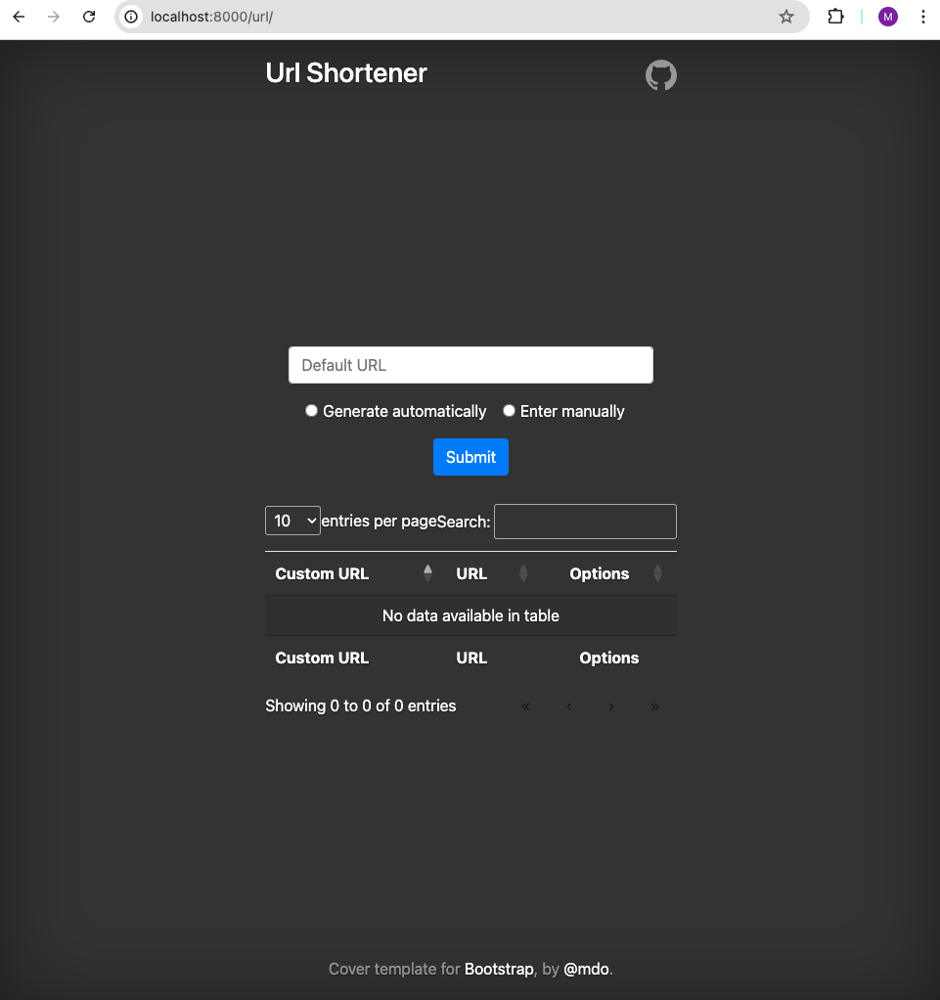
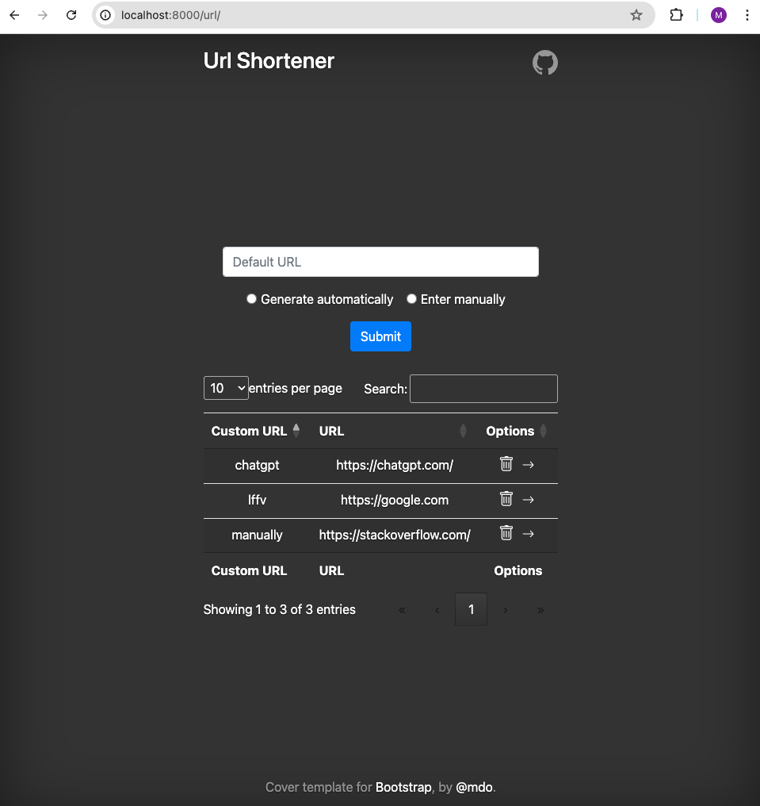
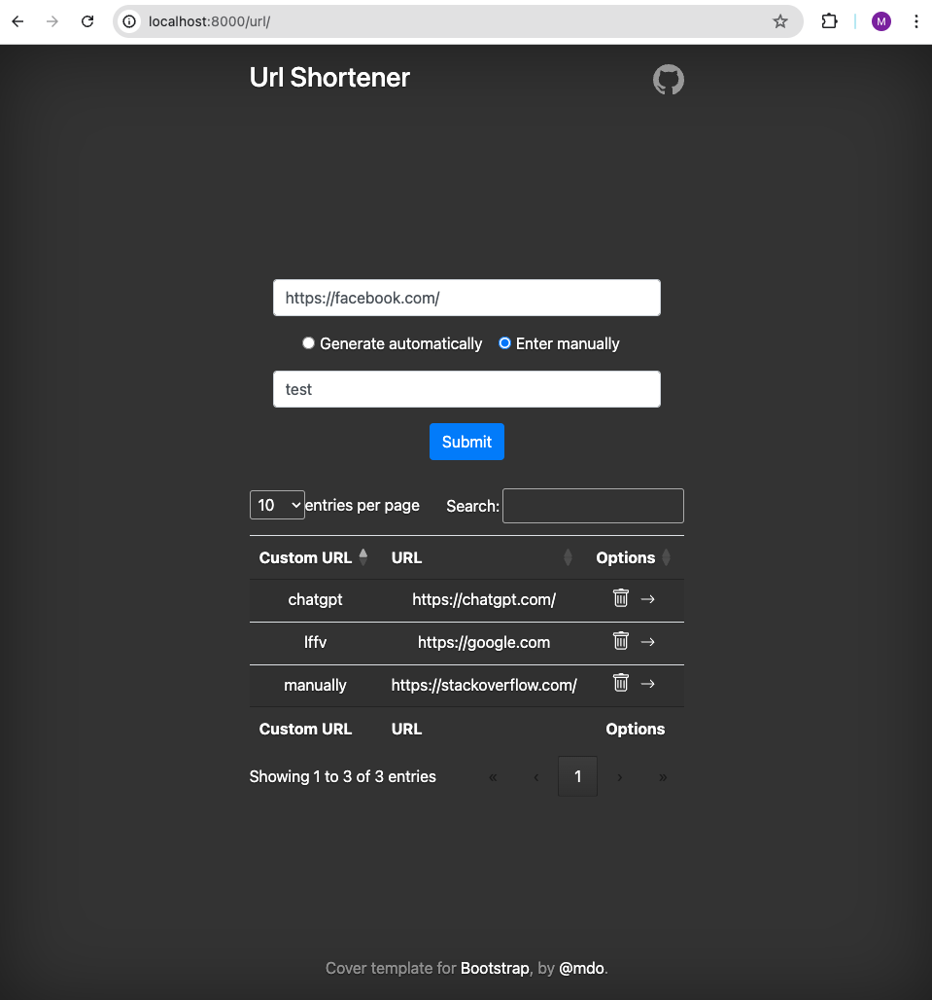

# url-shortener
This is a base project for a URL shortener built with Django for the backend and Bootstrap for the frontend. This project allows users to shorten long URLs, redirect short URLs, and keep a record of the created URLs.

## Features
- Shorten URLs: Users can input a long URL and get a short URL.
- Redirection: Visiting the short URL redirects users to the corresponding long URL.
- User-friendly Interface: The interface is built with Bootstrap for a modern and responsive user experience.
- URL Logging: Keeps a record of all shortened URLs with basic statistics.

## Requirements
- Docker
- Docker Compose

## Installation
Clone the repository
```
git clone https://github.com/MaciaKing/url-shortener.git
cd url-shortener
```

Configure env vars for .env.example file
```
PGUSER=CHANGEME
POSTGRES_USER=CHANGEME
POSTGRES_PASSWORD=CHANGEME
```

Run project
```
docker-compose up
```

## Example
Example of web views



